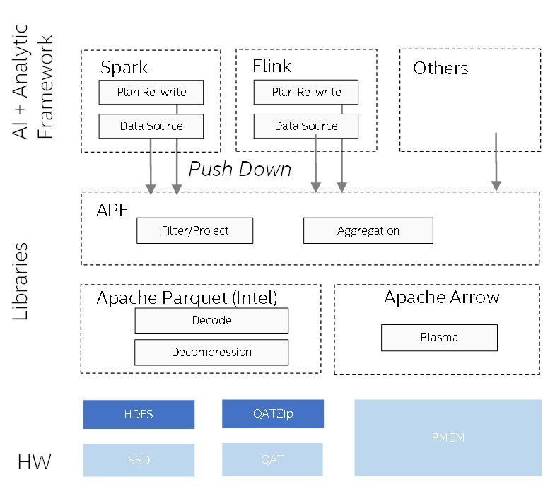

# Introduction
APE targets to improve data source side performance for multiple bigdata analytic framework such as Apache Spark and Apache Flink. Compare to other row based execution engine, Ape could utilize column format and do batch computation, which will boost performance in Ad-hoc queries. APE architecture is like below.  



Currently, we have implemented a native parquet data source with powerful filter push down and aggregation push down. We also provide both Spark ape-parquet adapter and Flink ape-parquet adapter. At the same time, APE provides a ColumnChunk level data source cache, which is based on Plasma, a share-memory object store.   

In the future, we will support more CPU features like AVX-512. Meanwhile, we will optimize other operators in SQL. 

# Development Status

Native Parquet reader and Spark/Flink adapter - Done  
Fine-grained filter pushing down - Done  
Parquet ColumnChunk level Cache - Done  
Aggregation pushing down - WIP


# How to Use APE

APE contains 4 components now, they are:
1. APE-native, native library, cover datasource read, filter push down and other features.  
2. APE-Common, a common jar for both ape-spark and ape-flink.
3. APE-Spark, a spark plugin for native parquet datasource. 
4. APE-Flink, a flink plugin for native parquet datasource.

## Dependency
APE currently has such third party libraries and Intel hosted libraries dependencies. Currently, user could install all these libraries by provided scripts like below. We will optimize cmake build steps to avoid this. 

``` 
# You need to pre-install these libraries on your worker nodes.
git clone https://github.com/oap-project 
cd oap-project
git checkout ape
sh ci_scripts/install_APE_dependency.sh
sh ci_scripts/install_arrow.sh
# install Java dependency pmem-common.jar
sh ci_scripts/install_pmem_common.sh
```

### [Arrow](https://github.com/oap-project/arrow/tree/ape-dev) & Parquet-CPP

We use Apache Arrow to load parquet file data natively from HDFS. We also use Arrow-Plasma as a KV store for caching. Arrow-parquet is modified for caching.

### Json

APE is using [nlohmann/json](https://github.com/nlohmann/json) lib to parse json between java and native. This is a header-only json lib. 
 
### Redis 
APE use Redis to store cache meta data. User need to install hi-redis and redis-plus-plus library. 

### libhdfs
Parquet-CPP will utilize `libhdfs.so` to read from hdfs, there two kinds of implementation. Both works but there are some differences.

One is Java based library which will use Java hdfs client to read data from hdfs, and hadoop provide this library in offcial release package under `$HADOOP_HOME/lib/native/`. There are some core dump issues when using an older hadoop version and JDK version, so we recommend to use hadoop-3.2.2 or higher version and use latest jdk-1.8.0_282.

The other one is pure native implemented library called [libhdfs3.so](https://github.com/erikmuttersbach/libhdfs3). you can refer this [link](https://github.com/Intel-bigdata/OAP/blob/master/oap-data-source/arrow/README.md#use-libhdfs3-library-for-better-performanceoptional) to install libhdfs3. There are some performance issue when using libhdfs3.so, it will page cache more data in some reading case. Before you run you workload, add below environment variable:
```
export LD_LIBRARY_PATH="${HADOOP_HOME}/lib/native":$LD_LIBRARY_PATH
export LIBHDFS3_CONF=/path/to/your/hdfs-site.xml
```

## APE Build

ICL jar build
```
cd /tmp;
git clone https://github.com/Intel-bigdata/IntelCodecLibrary;
cd IntelCodecLibrary/;
mvn clean install
```

Java build, we will use `$OAP_ROOT_DIR/oap-ape/ape-java/ape-common/target/ape-common-1.1.0-SNAPSHOT.jar`, `$OAP_ROOT_DIR/oap-ape/ape-java/ape-spark/target/ape-spark-1.1.0-SNAPSHOT.jar`, `$OAP_ROOT_DIR/oap-ape/ape-java/ape-flink/target/ape-flink-1.1.0-SNAPSHOT.jar` later.

```
cd $OAP_ROOT_DIR/oap-ape/ape-java
mvn clean package -am
```

CPP build
```
cd $OAP_ROOT_DIR/oap-ape/ape-native/
mkdir build
cd build
cmake ..
make
sudo cp ./lib/libparquet_jni.so /usr/lib/
```

## Run Spark with APE
 1. make sure you have installed `libparquet_jni.so` on all of your worker nodes.
 2. copy `$OAP_ROOT_DIR/oap-ape/ape-java/ape-common/target/ape-common-1.1.0-SNAPSHOT.jar` these file to Spark master node, add below configuration in your `spark-defaults.conf` file 
```
spark.files                         file:///path/to/ape-common-1.1.0-SNAPSHOT-jar-with-dependencies.jar,file:///path/to/ape-spark-1.1.0-SNAPSHOT.jar
spark.executor.extraClassPath       ./ape-common-1.1.0-SNAPSHOT-jar-with-dependencies.jar:./ape-spark-1.1.0-SNAPSHOT.jar
spark.driver.extraClassPath         file:///path/to/ape-common-1.1.0-SNAPSHOT-jar-with-dependencies.jar:file:///path/to/ape-spark-1.1.0-SNAPSHOT.jar
```

 3. run spark-sql workload

Extra configuration to enable ape features:

| configuration name | description | default value   
| :---: | :---: | :---: | 
| `spark.sql.parquet.filterPushdown ` | whether enable filter push down to Parquet native | true |
| `spark.sql.ape.aggregation.pushdown.enabled` | (Experimental) whether enable aggregation push down to Parquet native | false | 
|`spark.sql.ape.parquet.cache.enabled` | whether enable parquet cache, you need to start plasma service on worker nodes if you enable this | false |
|`spark.sql.ape.reader.location` | use local or remote reader in spark | local |
|`spark.sql.ape.remote.reader.compressed `| enable compression when use remote reader | false |
|`spark.sql.ape.remote.reader.compress.codec`| compression codec setting when enable compression, such as zstd, lz4-ipp, zlib-ipp, igzip. | zstd |

For disaggrated mode, cp `$OAP_ROOT_DIR/oap-ape/ape-java/ape-server/target/ape-server-1.1.0-SNAPSHOT.jar` to APE server and launch it using script like:
```
export HADOOP_CLASSPATH=`hadoop classpath --glob`
// take 40911 as example for the port number
java -cp ape-server-1.1.0-SNAPSHOT.jar:$HADOOP_CLASSPATH com.intel.oap.ape.service.netty.server.NettyServer 40911
```
To enable plasma cache, you also need to start plasma server on APE server node:
```
nohup plasma-store-server -m 1200000000000 -d /mnt/pmem -s /tmp/plasmaStore >> plasma.log 2>&1 &
```
Then at compute cluster side, cp jars of ape-server/ape-client to $spark_home/jars. Update hdfs-site.xml with following setting:
```
    <property>
        <name>fs.ape.client.remote.servers</name>
        <value>host1:port1,host2:port2</value>
    </property>
```
To enable compression, make sure native libraries for compression codecs should exist in both APE server and compute nodes, such as libparquet.so. 

## Run Flink with APE
[https://github.com/oap-project/sql-ds-cache/tree/ape/oap-ape/ape-java/ape-flink/README.md](https://github.com/oap-project/sql-ds-cache/tree/ape/oap-ape/ape-java/ape-flink/README.md)

(You can skip to step [6. Build APE-java](https://github.com/oap-project/sql-ds-cache/tree/ape/oap-ape/ape-java/ape-flink/README.md#6-build-ape-java)
if Hadoop cluster, Flink client, and above dependencies are ready.)

## Troubleshooting
Make sure you have set up `$HADOOP_HOME` environment variables. Make sure `libjvm.so` is in your `$LD_LIBRARY_PATH`.  
 
 If you got errors like below
 ```
loadFileSystems error:
(unable to get stack trace for java.lang.NoClassDefFoundError exception: ExceptionUtils::getStackTrace error.)
hdfsBuilderConnect(forceNewInstance=0, nn=default, port=0, kerbTicketCachePath=(NULL), userName=(NULL)) error:
(unable to get stack trace for java.lang.NoClassDefFoundError exception: ExceptionUtils::getStackTrace error.)
hdfsOpenFile(/tmp/testfile.txt): constructNewObjectOfPath error:
(unable to get stack trace for java.lang.NoClassDefFoundError exception: ExceptionUtils::getStackTrace error.)
Failed to open /tmp/testfile.txt for writing!
```
please execute commands(see [link](https://stackoverflow.com/questions/21064140/hadoop-c-hdfs-test-running-exception)):
```
export CLASSPATH=${HADOOP_HOME}/etc/hadoop:`find ${HADOOP_HOME}/share/hadoop/ | awk '{path=path":"$0}END{print path}'`
export LD_LIBRARY_PATH="${HADOOP_HOME}/lib/native":$LD_LIBRARY_PATH
```

# Others
For developers, before you commit cpp code, please run this command to keep code style clean(you need to install clang-format).
```
cd oap-ape/ape-native/ 
python3 ./build-support/run_clang_format.py --clang_format_binary clang-format --source_dir ./src/  --fix
```

